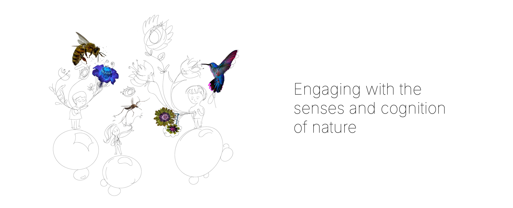
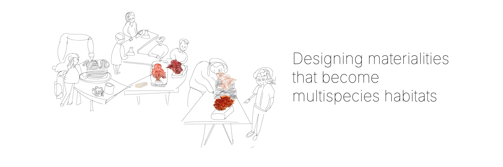

In the Anthropocene, we live in damaged landscapes. Our ecological crisis is also a crisis of meaning. We need to transform design cultures. I believe design can be a transformational force that restores our connection with the biosphere. 

___We need to rethink how we create knowledge in design.___
Our human-centric perception is narrow. I explore what it means to engage with more-than-human sensorial worlds. Nature is intelligent. I strive to understand and collaborate with the cognitive agency of other species. Nature is not silent. I experiment how to tap into systems of interspecies communication. How does mycelium thinks? How do moths experience the world? How can we communicate with soil?

___We need to  rethink what is materiality and how we fabricate and build.___
Design with nature entails a shift from designing with parts to growing habitats/ecosystems with living organisms. Many species are better architects than we are, so let´s collaborate with them. Collaboration that breaks down top-down control and omniscience of the human designer, human authorship. And collaboration not only for a design outcome, but to address their needs of the species we are collaborating with, to create livingness in artefacts, architectures and habitats so that every species can thrive. 

