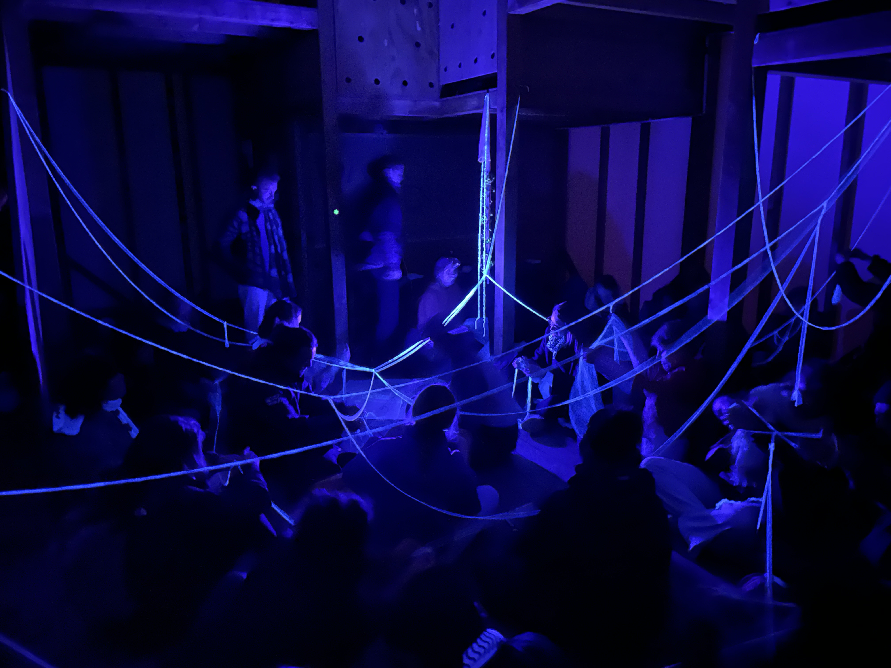

## Hello!

...I am a transdisciplinary researcher and futurist in multispecies design and nature-based solutions. I am skillful in a broad set of design and experiential futures methods that I apply in personal and commissioned projects to contribute to sustainability transformations. I explore and experiment on how to engage with more-than-human agency in knowledge making, to collaborate with the agency of living systems in material processes of design and ultimately to design for mutual flourishing and multispecies cohabitation.