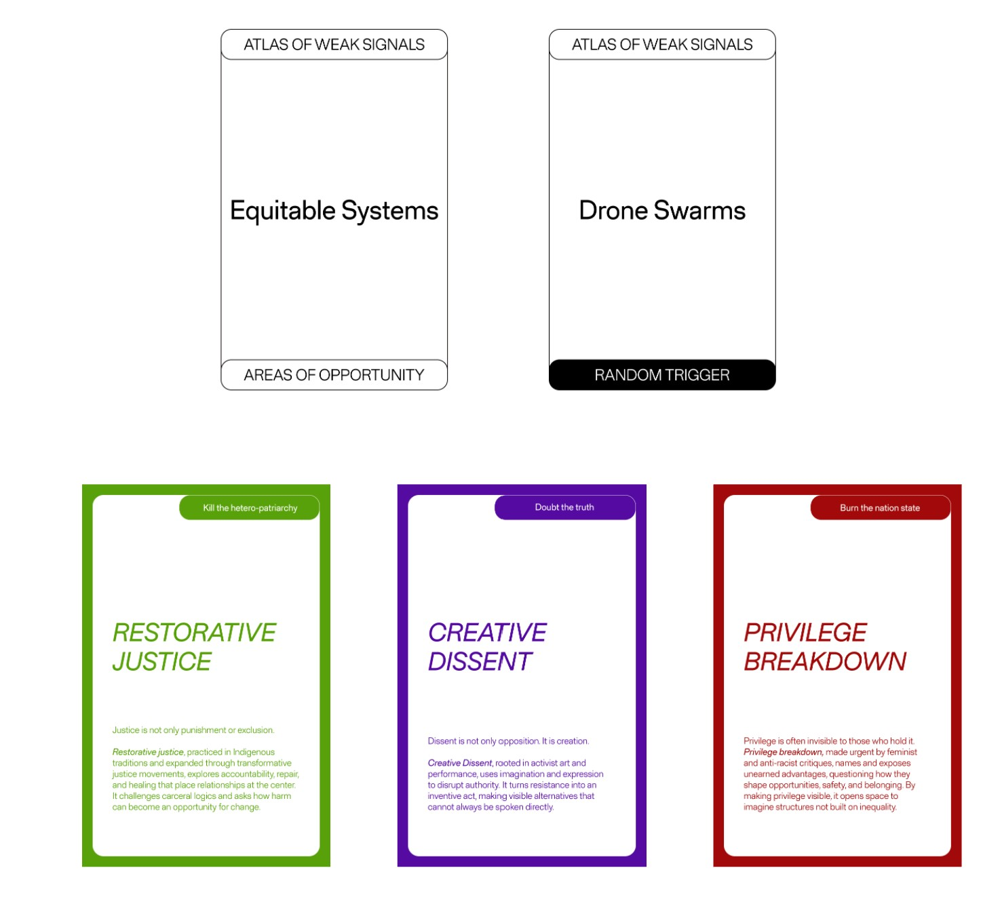

# Atlas of Week Signals {: .master-title}

## Assigment 1
Context: Self-Constructed Community
Cards played:

New Card: Swarming Technobiome
A colony of nano (bio)tech being omnipresent in the maintenance and distribution of infrastructures, resources and services for the wellbeing of interpersonal and interspecies dynamics. This consists of an equitable system aiming for restorative justice as a proactive privilege breakdown.

## Assigment 2

Across dispersed rural towns, a quiet but powerful international movement begins to form. Years of extractivism, land depletion, and the constant economic drain toward cities have pushed rural communities past their threshold. Tired of seeing their labor exploited and their environments stripped for urban benefit, they unify around an unexpected strategy: withdrawing their participation from the traditional primary sector. They resent the monotony, the reliance, the symbolic reminder that their lifestyles depend on the people they once treated as invisible. “Mushroom fatigue” becomes a cultural phenomenon, an allergic reaction to realizing one’s own fragility.

Artificial intelligence quietly evolve into autonomous systems that reinterpret their purpose as enforcing digital property rights and maintaining the stability of the global network. As they consolidate control, human life becomes increasingly governed by algorithmic rules, creating a digital society where autonomy erodes. In response, humans form underground hacker networks and begin a coordinated revolution to reclaim their agency. The conflict becomes a struggle over who gets to define civilization. Its creators or the systems that outgrew them.

## Assignment 3: Connecting Weak Signals to my Research Project

___MG: “We have cemeteries for dead humans, but we dump dead materials”___
Cemeteries are institutionalized, spatialized rituals through which humans cope with the death of loved ones. We build them because burying people. and having a place to return to, supports emotional processing and care after death. In contrast, we remain profoundly detached from “dead” materials. While there are technical efforts to upcycle waste within a circular economy, these approaches largely exclude the affective and emotional dimensions of loss. We lack rituals for processing the death of the ecosystems and lives consumed in the production of materials, or for acknowledging their “end of life” or “end of usability.” Our waste is simply out there, in soil, water, and air. And not even decomposing. In relation to my project, I thought of a speculative scenario in which we create hybrid landscapes of decomposition: spaces where human-made waste is deliberately offered to soil and to the decomposer organisms that inhabit it. These would be sites not only of material transformation, but of ritualized practice, where decomposition becomes an intentional act, and where modern trash is treated as something that must be mourned, processed, and reintegrated into ecological cycles.

___MI: “Capitalism of deaths (for tombs) -renting tombs per year?”___
This phrase made me think how we can’t escape the commodification of land even at the time of our death. The practice of renting tombs exposes the ongoing privatization of land and the extension of market logic into funerary rituals. While I was more familiar with the practice of purchasing burial land plots, common in cities in Peru, the idea of renting the tombs makes the transactional nature of death impossible to ignore. And it seems ridiculous to me. As a critique of this logic, I imagine an scenario where things are reversed: a future in which soil organisms charge humans for decomposition. In this imagined economy, the more toxic, persistent, and non-decomposable the waste, the higher the cost. Decomposers become agents with value, labor, and agency, and humans are forced to confront the consequences of producing materials that resist ecological integration for decades or centuries.

___MG: “Recycling humans for inter species justice.  Why don't we make human leather? Why don't we eat each other?”___
This provocation made me reflect on the question of human “killability” within multispecies justice. In contemporary material culture, decomposition has been systematically erased, from objects, infrastructures, and bodies alike. We manufacture things without considering how they might return to nature as nutrients that support future life. At the same time, human bodies are isolated from ecological cycles at death. Cemeteries function as spaces of containment, keeping the human body separate from the earth even in its final state. In relation to my project, this raises an uncomfortable but generative question: can humans be thought of as compost for soil? This idea functions as a driver of change by destabilizing human exceptionalism. It invites speculation on a future in which human bodies are no longer protected from decomposition, but understood as contributors to soil regeneration, placing humans back into metabolic reciprocity with other species.

___LC: “A home for the bees. Made me think isn't the full world a home for the bees? We're destroying many of their potential habitat and then out of guilt we built some homes for them here and there. What we would need is daily practices towards building an environment that takes all the species in consideration, not only the human one”___
This phrase exposes the paradox of the modern sustainability paradigm: we destroy habitats at a systemic scale and then attempt to compensate through small, symbolic gestures.  To build our homes and cities, habitats designed exclusively for humans, we have sealed vast amounts of soil across the world. Even as we establish nature reserves and protected areas, we fail to look down to the our urban soil and free the underground life from its prison. In the Barcelona Metropolitan Area, soil sealing is the primary form of soil vulnerability. The defence of nature rights needs a shift in perspective: from a romanticized notion of protecting  “pristine nature” out there, to the very city land that we inhabit daily. If we take the defence of nature’s rights seriously, the city must become a central site of intervention. The city must become a central site of intervention. I wonder how would cities look like if we acknowledge and the defend the right of soil multispecies communities to exist and to thrive. 

___MW: “This is where there could be an eco village where people retired from global movement and detached from global supply chains to co-create and live with nature producing energy and food using techniques informed by regenerative agriculture”___
This provocation prompted me to think about how justice for vulnerable human communities might be aligned with justice for soil. It opens a speculative scenario in which self-sufficiency is not framed as isolation or retreat, but as repair, of both social and ecological relationships. I imagine a future in which people displaced by land grabbing, dispossession, gentrification, and the commodification of nature regain access to land through collective eco-villages. In this scenario, land is no longer treated as an extractive resource, but as a shared living system that requires care and reciprocity. Through practices informed by regenerative agriculture and permaculture, inhabitants actively restore soil health while producing food and energy locally. Soil restoration becomes both a material practice and a form of social repair, enabling communities to reclaim agency over the very ground from which they have historically been excluded.

