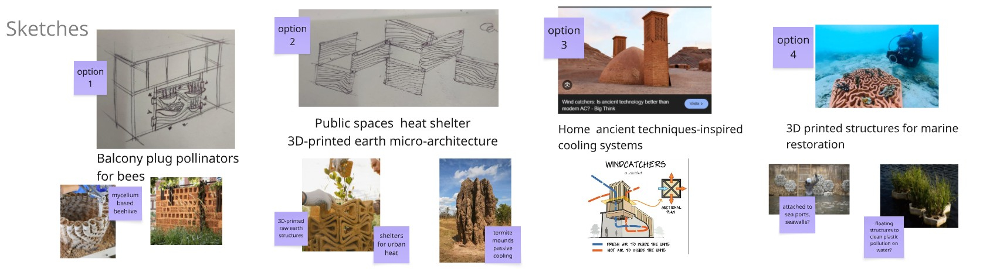
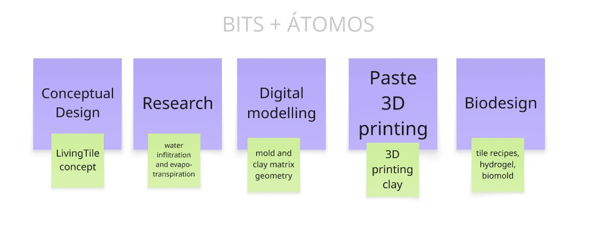

# Cognitive Orgies I: Living Tiles {: .master-title}

## Arriving at a common vision

Cognitive Orgies was an intensive design challenge where we needed to articulate our individual interests with rapid prototyping in 4 days. I teamed up with Ludovico. When the time came to map out our interests in the Venn diagram, I was positively surprised we had many in common: 

Out of our initial conversations, we came up with a “recipe” for our design intervention, which I really like as a framework for my own future work 

•	Nature as inspiration: both to learn from nature and to design for planetary health and multi-species wellbeing.  
•	Ancestral knowledge: vernacular, indigenous and traditional knowledge that is ecologically sustainable. This also included the recognition of nature intelligence, for example in fields such as biomimicry and animal architecture.  
•	Emerging tech: digital biofabrication was a good term to encompass our interest in molds and scaffoldings that can be used to collaborate with biological systems or create new materialities.  
•	Context: design that is social-ecological relevant.  

It can seem that these commonalities would made landing on an idea easier, however, because we had so many interests in common, we also ended up with many potential ideas. Our conceptual brainstorming perhaps took too much time, given the overall time we had. It took us 2 days to commit to one idea. Our initial 4 options were:

•	Balcony plug-in habitat for pollinators  
•	3D printed heat refuge for cities  
•	Passive cooling technique for houses  
•	3D printed sculpture for marine restoration   

Out of these 4, we chose to work with the concept of climate-responsive design, but instead of habitats we went for something small, and yet that could be scalable as well: pavement tiles, later named LivingTiles.

__LivingTiles makes the ground of our cities permeable again, creating a resilient system in times of extreme climate events. LivingTiles proposes an alliance with soil as a living climate infrastructure. Instead of treating the ground as a passive, inert surface, we want to reactivate the soil’s natural capacity to regulate climate, by absorbing water, storing moisture, and cooling the environment through evapotranspiration. Our design combines a layer of porous surface tile with a hydroceramic layer of clay and hydrogel beads.__

Although I am happy with our choice, I must admit I was a bit frustrated to let go of “bigger ideas” such as designing heat refuges in the cities for nonhuman species. The choice of tiles for me had a kind of metaphorical message to start with something small, instead of daydreaming of more complex ideas, which is how I have felt a lot of times during this master. It is also my own tendency as in my life of sustainability researcher I spent more time understanding big social-ecological systems and global flows rather than committed to local, material, hands-on experiments. Making a tile triggered an internal tension in me in that sense. How do I think of the small to the big? We did spend some time talking about the scalability of tiles in the cities, and how the spatial design of tiles (also if they can cover vertical surfaces of the city) could create “cooling corridors” in Barcelona, because weather perception also involves movement across space, not just isolated interventions. 

## Distribution of work and challenges

Although our interests were similar, our skills are not as we both come from different backgrounds. Ludovico is an industrial designer, and I am a sustainability researcher with some biodesign experience. 

Due to time constrains it came naturally to distribute work based on our current skills after the concept phase was over. You can see our fabrication process step by step here. I was in charge of material research, and of preparing the recipes for the tiles, the clay matrix and the hydrogel. Exchange of skills between me and Ludo was hardly possible due to lack of time. For example, I would have loved to learn how to create the tile molds and honeycomb matrix in Rhino but there was no time. Ludo was working at a speed that was too fast for me to catch up on what was happening. For the paste 3D printer however, I took a break of my duties to learn what I could when Santi was setting up the machine. But I’m sure I missed out a lot because I didn’t understand the software flow from Rhino to the 3D printer software. I understand the logic, but I couldn’t reproduce the software side alone. 

I guess the big lesson is we can’t know it all, but we need to learn to collaborate. And while I enjoyed collaboration during this week, I think is not enough to reach transdisciplinary integration of knowledge. I believe once we know how to work with a new technology or disciplinary technique, our ability to propose ideas also expands. For example, I am aware that I have a harder time thinking in 3D (compared to the average designer at IAAC) and, thus proposing ideas in a spatial dimension. For example, while I was slowly shaping an abstract visual figure in my head I would see Ludo have a full sketch in his notebook. The funny thing is that I actually love to draw and I do urban sketching but at my own rythm. If I have to pitch something visually and quick, I go blank. I think when I get to master 3D modelling and fabrication technologies that part of my imagination would unlock as well. 

So far I’m better at thinking in system diagrams, relations, circular causality, flows, tracing scientific cues and connecting them, because that is the language I learned in my sustainability training and work. Thinking about how design can perform multifunctionally (social and ecologically) at multiple scales, is where my mind goes. For example, thinking about the tiles as a solution to flooding was not enough for me, because I know that the paved and darker city surfaces are linked to two parallel problems: urban heating and flooding. Therefore, it only makes sense that the tiles are multifunctional: meaning that they can function for water infiltration, and evapotranspiration to cool down the city. I like it that I am becoming more aware of how my previous skills can plug-in in design challenges through exercises like this. 

During this week, I did not only learn practical skills on how to produce the materialities of the tile system we designed, but I also reflected about interdisciplinary processes of design collaboration. My hope is not to only become a better teamplayer in interdisciplinary teams, but also to nurture an interdisciplinary mind. To hold space for multiple ways of thinking: traditional, vernacular, tecno-scientific, artistic, etc. To speak the language of gcodes and machines and the of chemistry, biology and ecology. The culture that supports us in the design process is also important. I still remain hesitant on how rapid prototyping processes as they are in the culture of DIY and FABLAB communities can be compatible with biological processes and more in-depht material research. I think that any project that involves mindfully biology and ecology needs to negotiate time expectations. 

Our common interests may look redundant from the outside, but redundancy is not a weakness. In fact, cultural and biological redundancy is a key trait of resilient systems. Ecosystems thrive because multiple species can perform similar functions; if one fails, the system does not collapse. I see now that interdisciplinary collaboration works in a similar way. Shared interests do not limit a project, they create reinforcement and allow for depth. That same foundation allowed us to explore without losing coherence. At the same time, resilience is not built on sameness alone, it also depends on diversity. In our collaboration, we were redundant in interests but complementary in skills. We shared similar visions, yet we approach them through different capacities. 

And finally I wanted to track how our initial conceptual interests and how they show in our final project LivingTiles: 

<table>
  <thead>
    <tr>
      <th style="text-align: left; width: 25%;">Theme</th>
      <th style="text-align: left;">Description</th>
    </tr>
  </thead>
  <tbody>
    <tr>
      <td><strong>Nature as inspiration</strong></td>
      <td>
        Soil is an active agent in climate regulation and adaptation.
        Our tile design was aiming to make surfaces permeable again to tap into these 2 ecological functions:
        evapotranspiration and water storage that are “silenced” nowadays in cities due to paved surfaces.
      </td>
    </tr>

    <tr>
      <td><strong>Ancestral knowledge</strong></td>
      <td>
        We didn’t have time to fully research on this aspect. It was part of our initial conversation,
        mentioning things like passive cooling in traditional architecture, the sophisticated passive cooling
        and ventilation systems that termite mounds have, and projects of clay and terracotta that allegedly
        are inspired by traditional techniques. Overall, on the surface research we did here, we identify an
        overarching pattern that passive cooling can be achieved by geometry and by materiality (involving soil, clay).
      </td>
    </tr>

    <tr>
      <td><strong>Digital biofabrication</strong></td>
      <td>
        We managed to test for the first-time how-to 3D print clay. Although it took a whole day of our process,
        it was worth it! This was perhaps my favorite part. I do believe that traditional techniques of form finding
        with clay are equally valuable, but I believe 3D printing can help for rapid prototyping and detailed geometry.
      </td>
    </tr>

    <tr>
      <td><strong>Context</strong></td>
      <td>
        Climate change impacts in cities were our context of concern: urban heat and flooding in Barcelona.
        However, we haven’t had time to test the final result on site. That for sure would start a cycle of tests
        and failures and many more iterations of experiments. In a week perhaps that is too much to ask.
        But it is something that I want to try in the future.
      </td>
    </tr>
  </tbody>
</table>
