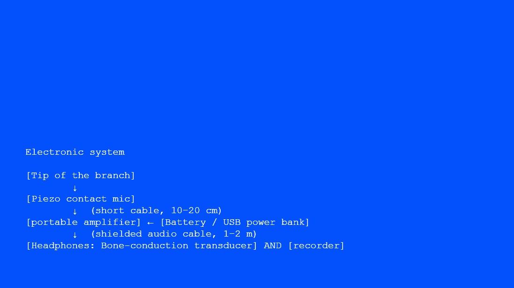
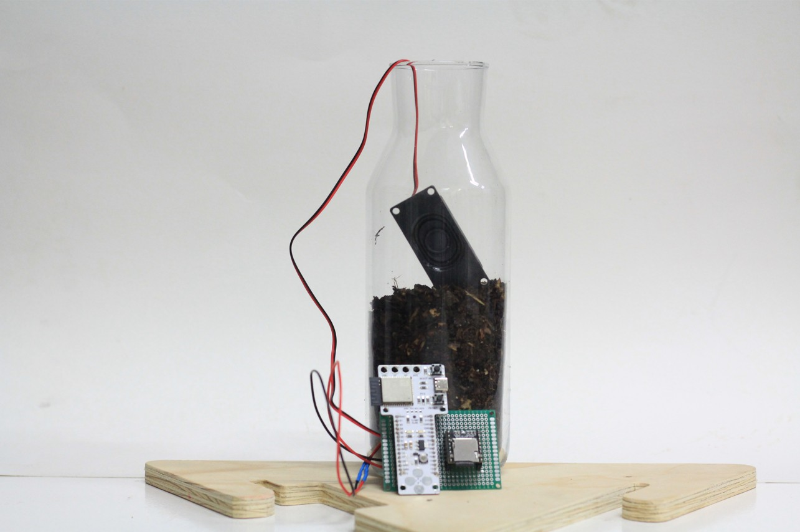
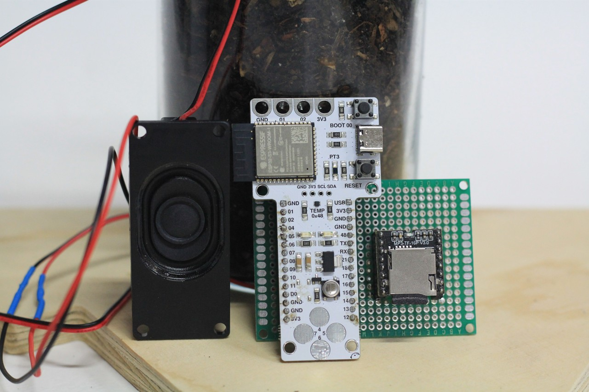
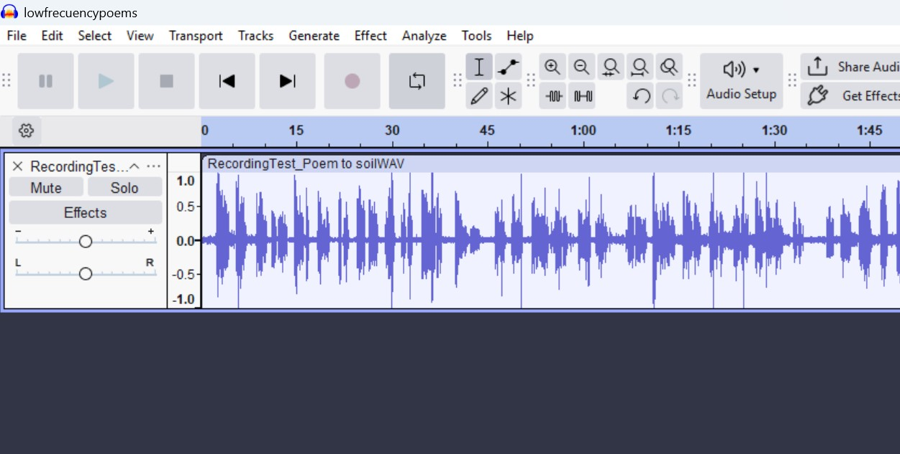

# I Context: A call from the mountains {: .master-title}

In modern cities, mountains are treated as objects. They are the background of human activities. Meanwhile in other non-western indigenous traditions mountains are subjects. In Andean worldviews, mountains are apus, spirits, montañas sagradas. They are animate, have personality, will and consciousness.  People speak to the mountain, a symbolic act that addresses the mountain as a subject with agency. In rituals of Pago a la Tierra, people give offerings to the land: corn, coca leaves, tabaco, animals, to show gratitude or ask for blessings. That is how they enact reciprocity with the land. Amid a growing interest in interspecies communication in the western world through technical and scientific methods, I wanted to explore interspecies communication with the mountains through intuition-led, affective and embodied modes of inquiry 

## Method: first-person research to communicate with the mountains

I adopted a first-person perspective to explore how interspecies communication with mountains might be practiced and understood. This methodological orientation emerged through reflection on my visits in 2025 to mountains in Peru and Japan that resonated deeply with me on emotional and spiritual levels. I became aware that I was already engaging in a form of interspecies communication during these visits, even though it was not explicitly framed as such at the time. From these encounters, I developed two design protocols through post-reflection, which allowed me to articulate early insights into interspecies communication. Building upon them, I later created a third protocol to explore communication with Montjuïc, a mountain in Barcelona. Together, these protocols function as both documentation and methodological tools for exploring how humans can engage in interspecies communication with mountains. 

## Protocol 1: mountains as kin


In early 2025, I visited the Peruvian mountains connected to my grandparents’ lineages in Satipo (Junín) and Huamanga (Ayacucho). These walks were conceived as acts of making kin with the mountains, and of reconnecting with landscapes that are inseparable from my family history.

This protocol functions as a ritual of communication intended to remember and re-activate the relationship between my human lineage and the mountains. It begun by visiting landscapes intertwined with family stories, sometimes accompanied by relatives and sometimes alone. A key practice is the conscious recollection of names—of family members and of the mountains themselves—as a way of situating oneself within a lineage that includes both human and more-than-human actors.
Upon entering the mountain, introducing oneself is an essential gesture of respect. I then asked the mountain for guidance in unveiling family history. As the walk unfolds, I situated myself within known family narratives and anecdotes while remaining attentive to the unknowns. As we enter deeper into the mountain, we trust we will get answers: emotionally charged encounters with biotic and abiotic elements are treated as messages. Some interactions trigger memories and stories shared by my grandparents; others provoke speculation and imaginative reconstruction. I understand this process as an archaeology of family memory. After sharing intimate and emotional moments with my family, we embraced mountains as kin. The feeling lingers even now. A practice to nurture this connection is talking to my human and mountain ancestors to ask for guardianship.
I chose this context as an example of interspecies communication because it is my heritage. The practice of speaking to mountains has been present in my family across generations. On my mother’s side, my grandmother Edith Cebrián used to sing to the mountains. At the age of fourteen, she left her life behind in the mountains of Huamanga (Ayacucho) to migrate to Lima, saying goodbye to the land and promising never to return—a promise she kept. In January 2025, some of her descendants, including myself, returned to these mountains for the first time. My grandfather Víctor Moreno maintained a deeply contemplative relationship with the land, often walking and meditating in the tropical mountains of Satipo. It was during one of these walks, on his 56th birthday, that he died in an accident when a loose tree fell on him. 
These narratives shape my understanding of mountains not as passive landscapes but as active participants in family history. Migration to the city has distanced my living family in Lima from the land, resulting in the loss of important practices of interspecies communication, such as Pago a la Tierra—an Andean ritual of reciprocity with the land. These visits revealed not only collective histories but also personal insights. The mountains offered responses that I later translated into creative expression, including two poems written during these encounters.


Poem for my grandmother Edith.
Huamanga Mountains, Ayacucho. January 2025

<table border="1">
  <tr>
    <td>
  
De lila a azul, <br>
un atardecer que me traspasa la piel. <br>
De 1934 al 2025, <br>
la sangre que nos recorre y que ha encontrado su camino de vuelta. <br>

Te fuiste a los 10 años de Ayacucho, <br>
y a los 75 años de este mundo, <br>
y nunca volviste a este atardecer, <br>
y yo, tan lejos me he ido antes de traerte de vuelta, <br>
algo de ti, <br>
la parte que vive en mí. <br>

Y aquí estoy en Ayacucho, mami, <br>
A veces Eduarda, <br>
A veces Rosa, <br>
A veces Edith Cebrián Rojas. <br>
Con el último nombre te conocí yo. <br>
Presumo, a veces, ser la nieta que más tiempo pasó contigo, <br>
pero que tan poco se de tu historia en Ayacucho. <br>
¿Por qué te fuiste de niña? <br>


Desenterramos recuerdos, una arqueologia emocional. Lo que queda al descubierto se siente como un nervio expuesto. Una injusticia sin rostro: el racismo-clasismo que mató a tu madre. Allá a inicios del siglo XX, Pedro Cebrián Matamoros, un mestizo con privilegios, se casó con Cirila Rojas. Una mujer muy hermosa, pero muy humilde según la recuerda la memoria familiar. El matrimonio fue mal visto, pero la sentencia llegaría el día del parto de tu hermano. La partera fue amenazada: si atendía a tu madre, nadie le daría más trabajo. No hay poesía que pueda maquillar la tragedia: Tu madre murió en el parto, y un remolino de dolor se llevó a tu padre también. Don Pedro se escondió en el alcohol. Semanas después, en un descuido, murió tu hermano de cólicos. En el cielo arde tu dolor. <br>

¿Cual atardecer te vio escapar? <br>

Prometiste no volver, pero nosotros hemos vuelto. Volvimos para sentir profundo. Para encontrar la lápida de tu padre con su nombre completito; y a tu madre enterrada debajo de la capilla del cementerio, “al fondo nomas”, sin lapida y sin nombre, con su historia anónima también en la memoria familar ¿Por qué mami? Nunca encontramos una foto suya. Mi mamá me ha contando, por primera vez, que tu la llamabas Lila. Sonrío. Es mi color favorito y siempre me rodea. <br>

Hoy la Lila del atardecer me abraza en esta montaña, con el calorcito del sol que ya se fue, que suavemente se despide. Aún estás conmigo, mami, suavemente abrazándome también. En Lila, siempre. <br>

</td>
  </tr>
</table>


Poem for my grandfather Victor Moreno
Satipo Mountains. February, 2025

<table border="1">
  <tr>
    <td>

Victor Moreno nació en La Libertad pero emigró 2 veces, la segunda a Satipo. Siempre sentí la relación con mi abuelo como intrascendente. El vivia lejos y mantenía una distancia emocional conmigo a la que me acostumbré. Pero fue él quien me regaló mis primeras memorias de la selva. Recuerdo mi primer viaje a Satipo en un bus interprovincial. De un lado, las estrellas a través de la ventana, y del otro, a mi mamá desmoronándose del soroche. Recuerdo el olor a la timolina, y su promesa de que ya vamos a llegar, hijita. Recuerdo despertar y ver esas montañas tan verdes por primera vez. Siempre las veo un poco en la memoria. Recuerdo mi incredulidad cuando me dijeron que cruzaría el río en un huaro, una tablita que colgaba de 4 cables de dudosa calidad.

Recuerdo el llano más arriba de las montañas donde vivía mi abuelo. Recuerdo secar cacao al sol. Y en las noches, la sopa con yuca frita. La oscuridad profunda. El cielo infinitamente habitado de estrellas. La vía láctea por primera vez. Lo recuerdo a él contando historias a la luz de la vela, historias de espíritus del monte, de reencarnación y otros eventos paranormales. Suspendida en sus historias, olvidaba la distancia que el territorio y, quizá mi abuelo mismo, habían puesto entre nosotros . Si mi abuelo alguna vez me dio algún consejo no lo recuerdo, pero él me dio la selva y las noches estrelladas.

Él murió el día de su cumpleaños. Caminaba por su chacra cuando un árbol le cayó encima. Tan casualmente. Por mucho tiempo cuestionamos esa historia con mi mamá ¿Cómo puede caer un árbol tan de repente? En febrero del 2025 volví a Satipo. Frente a la tumba de mi abuelo, le contaba a un amigo la historia del árbol, sin creerla aún. Al día siguiente, me encontraba en una comunidad Ashaninka, cuando un árbol cayó en el umbral de una puerta que solo segundos antes habían cruzado 2 personas. Y así, quizá por primera vez pensé en mi abuelo de forma trascendente. Sentí, quiza ingenuamente, pero certeramente, que era él, diciéndome, hijita ve y cuéntale a tu madre que fue un árbol, que fue la selva y solo ella que me llamó para llevarme adentro. Aquí estoy abuelo, pensé, creo que Satipo me está llamando también.
</td>
  </tr>
</table>


## Protocol 2: Self-Transcendence in the Mountains


In June 2025, I visited Kyoto and repeatedly hiked Mount Kurama. During these walks, I engaged in interspecies communication by following openly shared cultural practices rooted in Shinto and Buddhist traditions. The protocol was articulated a posteriori and is not intended as cultural appropriation, but rather as documentation of lived experience and recognition that interspecies communication is embedded in many non-Western knowledge systems. In Shinto cosmology, mountains are kamis.  Kamis are sacred spirits or divine phenomena inhabiting nature… the spirits of the mountains, river, ancestors. This understanding resonates strongly with Andean cosmovisions, where mountains are known as Apus.

This second protocol centers on nurturing spiritual connection with the mountain through rituals of reciprocity as a form of communication. The trail from Mount Kurama to Kuramadera temple is particularly significant, as it weaves together Shinto and Buddhist practices. Before entering the mountain, I participated in a ritual of water purification, washing my hands and mouth with water sourced from the mountain itself. Before crossing torii gates, I bowed and clapped in prescribed sequences to show reverence to the kamis.

Along the trail, I passed through multiple torii gates, some formed by built structures and others by natural elements such as 800-year-old cedar trees. Each crossing marks a threshold between the everyday world and the sacred realm. Upon reaching Kuramadera at the summit, I practiced prayers of gratitude and made offerings, including a poem, before I asked for blessings.

This experience reaffirmed my intuition that rituals are powerful entry points for interspecies communication. Rituals are not just symbolic but very physical acts. Every action of washing the hands with water of the mountain for purification, bowing to the cedar trees before crossing their path, is not just a physical engagement but a cognitive commitment to transcend our state of consciousness. Through reverence toward nature, I experienced moments of self-transcendence, not as erasure of the self, but as integration into a larger whole.

I also learned that communication implies consent, and that consent may sometimes be withheld. Mount Kurama is known as the birthplace of Reiki, and during one visit I felt compelled to walk a particular trail associated with it. I hesitated and asked for consent at a nearby Shinto shrine and sat on the bark of a tree—where I was immediately bitten by an insect, causing intense pain for hours. I interpreted this experience as a clear response: not today. This moment underscored that interspecies communication is not about control or access, but about listening and respecting refusal.

## Protocol 3: mountains as emotional companions


On September 30th, 2025, I arrived in Barcelona and felt an immediate pull to visit the closest mountain to my new place of residence: Montjuïc. On my very first day in the city, I hiked up the mountain to introduce myself—to the land and to the city. I watched my first sunset in Barcelona from its slopes and asked the mountain for blessings. This initial encounter inspired the design of a specific protocol to explore Montjuïc as an emotional companion through repeated visits. The protocol consisted of four hikes conducted over the span of two weeks. It was designed a priori and focused on multisensorial attunement and multimedia documentation. 
This protocol relies on multisensorial immersion as a data collection strategy. Each visit followed the same observational structure, allowing for comparison across time while remaining open to emergent experiences. The following elements were documented during each hike:

-Temporal context: time of day and environmental conditions.
-Embodied state: initial and final physical and emotional conditions.
-Tactile and olfactory engagement: touching leaves, soil, rocks; noting textures, temperature, moisture, pace, oscillations, pauses, and stops.
-Soundscape categorized as:
Biophony: sounds produced by living organisms (e.g., birds, insects),
Geophony: non-biological natural sounds (e.g., rain, wind),
Anthrophony: human-made sounds (e.g., traffic, voices).
-Human movement: trail location, directionality, repetition, and morphology of movement.
-Linguistic communication: pre-planned speech directed toward the mountain.
-Responsive communicative acts: improvised oral or written responses triggered by environmental cues, including memories, emotions, and impulses to express through speech, touch, or poetry. These spontaneous acts were recorded as audio or text.


<table border="1">
  <tr>
    <td>
- **Example: Montjuïc visit, day 3**<br>
- **Initial physical state:** physically exhausted after hiking to Valldaura Labs; still recovering from the flu.<br>
- **Initial affective state:** tired, longing for company without conversation; seeking reflection and quiet presence.<br>
- **Tactile engagement:** intermittent rain felt on the body; contact with wet leaves, soil, and rocks.<br>
- **Olfactory engagement:** smell of rain and wet earth.<br>
- **Voice:** poems were recited aloud at the summit and reflections recorded orally; otherwise, silence was maintained.<br>
- **Soundscape:**<br>
  - **Biophony:** birds and insects<br>
  - **Geophony:** intermittent rain, heavier at the beginning of the hike<br>
  - **Anthrophony:** traffic noise near the base, fading into quiet at the top, with distant white noise from the city<br>
- **Movement:** continuous upward movement along a fixed path—stairs, concrete pathway, soil trail—ending at the highest point aligned with a row of palm trees.<br>
- **Speech:** poems recounting my encounters with other mountains I had visited that year<br>
- **Final state:** physically tired but emotionally restored<br>
</td>
  </tr>
</table>


## Analysis and reflection 

The third day of visits was marked by doubt. I questioned whether it was worth hiking that day, feeling depleted and unsure of my capacity to be present, similar to meeting a friend when one is exhausted. By the end of the hike, I initially interpreted the experience as non-communicative. However, that same night I woke up abruptly at 4 a.m. with a clear realization: the mountain is a living agentic presence that participates in my emotional life. They are not just objects that help me to represent my emotions, they help me to regulate and transform them. This experience echoed previous moments of nocturnal clarity, most notably after my first visit to Mount Kurama. Recognizing this pattern reinforced my understanding of interspecies communication as something that extends beyond the moment of encounter.

With this realization that I can relate to mountains as emotional companions, I approached the fourth visit with heightened intentionality. I explicitly asked the mountain to be my emotional support and gave myself permission to be vulnerable. I arrived emotionally overloaded, unable to tell my emotions apart. During the walk this became clear. Although the trail remained the same, its consistent upward morphology created a sense of emotional momentum. Reaching the summit at sunset initially felt peaceful, yet shallow. Watching airplanes cross the sky triggered my feelings of uncertainty due to my recent relocation to Barcelona: although I had physically landed in Barcelona a couple of weeks ago, emotionally I still felt suspended elsewhere, ungrounded. 

As darkness fell, uneasiness intensified and culminated in frustration. I allowed myself to release it. In that moment, the mountain became a space where I felt held and heard. I addressed my human and mountain ancestors, asking for guidance, an act possibly prompted by the nearby cemetery. I began moving repeatedly in a triangular pattern shaped by the terrain: a line of palm trees, the cemetery wall, and the site entrance. My pace accelerated in response to resurfacing emotions: restlessness, displacement, lack of belonging. I asked, explicitly, to feel grounded.

Gradually, my gaze dropped toward the soil as my movement slowed. Drawn to the center of the triangular space, I noticed tiny mushrooms emerging from the ground, which species I couldn’t identify. In that precise moment, I found a gravitational center in that space and moment, and a sense of being held by the soil itself. My breath eased, accompanied by emotional relief and wonder at life underground. Previous experiences with fungi as metaphors for emotional and ontological processing likely informed the intensity of this encounter. I interpreted this moment as a call from the soil, deeply aligned with my desire for grounding during this transitional phase of my life.

Moreover, this protocol highlighted vulnerability as a central condition for interspecies communication. Vulnerability is what renders communication, human and more-than-human, meaningful. Emotional intimacy is not confined to established human relationships; it can emerge with strangers, fleeting encounters, and, as my experience suggests, with mountains.

This experience led me to reconsider the premise of my research. Meaningful communication with mountains may have less to do with advanced technologies or sophisticated algorithms—although those have their place—and more to do with cultivating openness and vulnerability. Mountains, as emotional companions, are peculiar beings: vast in scale, shaped by deep geological time, and offering a perspective in which human lives appear fleeting. It is from this temporal and spatial immensity that I sense a form of wisdom in mountains, one that invites humility, grounding, and care.

<iframe 
  width="100%" 
  height="315" 
  src="https://www.youtube.com/watch?v=9pZP2DQsQqw" 
  title="YouTube video player" 
  frameborder="0" 
  allow="accelerometer; autoplay; clipboard-write; encrypted-media; gyroscope; picture-in-picture; web-share" 
  allowfullscreen>
</iframe>


## Personal Manifesto

I understand communication not as an empty exchange of information nor as a purely rational processing of data, but as a reciprocal act that cultivates material, affective, emotional, and spiritual entanglements with the more-than-human world.
Communication begins with recognizing the agency of mountains. Mountains are not passive landscapes but living, sensing, and responding presences. I ask for their consent to visit them, and I give my consent to be visited, acknowledging that communication is always a two-way act. 

I communicate with mountains to remember my kinship with nonhuman beings. Mountains are my ancestors. Visiting them activates autobiographical and family memory, allowing me to feel close to those who came before me. Through speaking with both human and mountain ancestors, I practice guardianship as a shared responsibility across generations and species.

I communicate with mountains as an act of deep vulnerability to nurture mutual healing. Mountains are my emotional companions. By offering them my vulnerability, I learn to trust them with my feelings, while also becoming attentive to their own fragility amid anthropogenic disruptions. I receive emotional restoration from mountains, and in return I commit to care for, restore and heal their damaged or threatened landscapes.

I communicate to experience spiritual self-transcendence. Mountains are sites of pilgrimage and transformation. Through rituals of reciprocity, they afford transitions into altered states of consciousness, to experience the boundless flow of nature.  The sacred emerges through embodied practice, reverence, and sustained relationship.

# II Prototyping Actions: interspecies communication with the mountain {: .master-title}


__ Conceptual Definition: I want to design an interspecies communication system to engage and practice mutual healing with the mountain interspecies communities, as a radical act of reciprocity. __

*Hypothesis 1*: I can embody the stillness of the mountain as a form of human communication. This can help me to train myself to embrace stillness as a form of communication to cultivate attentiveness to nature. 
*Prototype idea 1*: I can create ritualistic practice that involves stillness as a form of communication. The set up will consist of 2 people sitting in meditative positions facing each other. The experiment consists in looking at each other’s eyes for 20 minutes while holding a still facial expression and body posture
This exercise also helps me to decenter myself from human communication standards because my human relationships are full with words, and sometimes I judge human communication based on the capacity of people to orchestrate words in a beautiful way. And it doesn’t have to be. I thought of the mountain as a teacher in how I communicate. I want to test what would it be like to communicate with somebody that I already know not with words but with static presence (being present while remaining still or unmoving). 

*Hypothesis 2*: I can “listen to the mountain” by becoming an extended body of branches with contact microphones while I conduct meditative walks in Collserola Mountain. 
*Prototype idea 2*: EchoingBranches is a wearable sensor-body made from branch-like arms that mechanically interact with the mountain surfaces.  The branches pick up low-frequency/mechanical vibration and surface contact; sensors at their tips convert these mechanical signals into electrical signals; those signals are sonified (or frequency-shifted) and delivered to your skull via bone-conduction transducers, letting you perceive the mountain’s textures and micro-movements as sound/vibration.

*Hypothesis 3*: I can create an ecoacoustic system to contribute to increase biodiversity in Collserola mountain. Ecoacoustic restoration is the interdisciplinary field that studies and applies sound-based methods to restore damaged ecosystems.
*Prototype idea 3*: EchoingSoil is an experience that allows me to communicate with the soil for mutual healing.  Sounds of the soil can offer me restorative effects, and, in turn, I can broadcast restorative sounds to the soil microbiota


# III Acting Individually: Towards Mutual Healing {: .master-title}

## Conceptual Statement

In a modern world that has forgotten to listen to the voice of Mother Nature, I want to create an embodied interspecies communication system to listen and speak to the soil.  Inspired by notions of reciprocity, biophilia and ecoacoustic restoration, I frame the exchange of sounds and vibrations between humans and soil as a practice of mutual care and healing.

## Action Strategy: ritualistic + scientific-technical

I wanted to explore integrating different entry points into interspecies communications. On one hand, I wanted to approach communication with the soil as a deeply affective and intuitive-oriented practice, and on the other hand, I wanted to explore scientific frameworks of communication as a form of sonic restoration of biodiversity, and the use of electronics to communicate with the soil.

!!! note "Site: Collserola Mountains"
    Collserola is a Mediterranean forest ecosystem, featuring distinct habitats such as holm oak and pine forests, gallery forests, scrubland, and aquatic environments.  
    The area is characterized by plants like holm oak, Aleppo pine, and various oaks, supported by a diverse range of fauna, including wild boars, genets, and a variety of birds.  
    As students, we have access to Valldaura Labs, situated at the top of one of the mountains.

    There were a few contexts around Valldaura Labs that were initially of interest to me:
    
    - **A:** Broadcast combined sounds of natural predators of squirrels and squirrels’ alarm calls as acoustic repellents to protect nurseries for oak trees
    - **B:** Broadcast sounds of birds, insects, and small mammals for wildlife recolonization in patches of connectivity interest
    - **C:** Broadcast sounds for soil microbiota (fungi, bacteria) in our collective land plot to grow medicinal plants

    I ended up choosing option **C** because of my ongoing relationship with the land plot and my interest in exploring my entanglements with soil.


## Artifact 1: EchoingBranches

Augmented branches is a sculptural extension of my body — a structure of tree branches that allows me to listen to the vibration of my movement through the soil and record it. Each branch is equipped with contact microphones at its tips. As I move, the branches brush against the environment, picking up subtle vibrations and surface contacts. These mechanical signals are converted into electrical ones, then the sound is transmitted to my skull via bone-conduction transducers and recorded. Through this prothesis, I can explore the restorative effects of the sound or vibrations of the soil morphology as I climb Collserola. 


### Technical strategy: system of contact microphones 

The initial idea was to also collect those sounds to broadcast it to the soil microbiota in the collective garden. However, due to technical problems with the contact microphone that I bought, I didn’t fully develop this artifact. I wore the branches and engaged only with the vibration of my movement in the soil morphology as I hiked up to the land plot. 




## Artifact 2: EchoingSoil

EchoingSoil is an electronic system that broadcasts sounds to the soil microbiota to enhance soil biodiversity and improve nutrient cycling and plant growth. Iterative sounds of 8Khz can stimulate beneficial fungus (e.g. Trichoderma harzianum) that promotes plant growth, nutrient cycling, and pathogen resistance


### Scientific strategy: Sonic restoration of soil 

One source of inspiration for this action is the field of ecoacoustic restoration that sustains that by orchestrating soundscapes, we can increase the likelihood of organisms recolonizing degraded habitats. Specifically, I want to explore sonic restoration of soil. 

It has been recently studied that soil microorganisms not only emit sound but are also able to listen to it through a mechanisms of mechanoperception, with behavioral impacts. Earthworms, isopods, roots, bacteria, and fungi all respond to mechanical vibrations. For example, I followed a scientific protocol that tested sound at specific frequencies of 8 to 11 Khz to stimulate Trichoderma harzianum, a beneficial fungus that promotes plant growth, nutrient cycling, and pathogen resistance. The treatment with sound increase biomass growth in the fungi. 

*Scientific parameters for sound traits*

| **Parameter** | **Based on Robinson et al. (2024) and related literature** |
|--------------|------------------------------------------------------------|
| **Frequency range** | Band-limited noise including frequencies from roughly 4,000 Hz up to 11,000 Hz, centered on 8,000 Hz (4–11 kHz bandwidth, 8 kHz peak). Lower frequencies (<1 kHz) travel better in soil but may affect organisms differently; some low frequencies inhibit fungal growth. |
| **Sound level** | Around 80 dB SPL measured near the source. Keep below ~90 dB to avoid adverse effects or soil heating. |
| **Duration** | 30 minutes per day for 5 days yielded clear effects. Continuous 24/7 playback has not been tested and may not be necessary; intermittent exposure appears more realistic and energy-efficient. |
| **Signal type** | Continuous monotone or band-limited noise (not music). In laboratory settings, a pure 8 kHz tone file (“tinnitus masker” audio) was used. |
| **Medium coupling** | The speaker must be in direct contact with soil (e.g., embedded waterproof transducers). Sound attenuates rapidly with depth, especially above 1 kHz. |
| **Target organisms** | Beneficial fungi (especially *Trichoderma*) and possibly bacteria. |

### Technical strategy: Arduino system to broadcast sounds to the soil 
I built an electronic consisting of a Barduino connected to a DFplayer and a small speaker. Then I programmed in Arduino IDE a step that controls the broadcasting of the sound of 8kHz. The audio will play 30 minutes one time a day, and repeat this for 5 days.
 
*Electronic system: Wiring diagram*


*Electronic system: Coding for Arduino IDE*

!!! example "Arduino sketch — DFPlayer soil sound playback"
    ```cpp
    #include <SoftwareSerial.h>
    #include <DFRobotDFPlayerMini.h>

    SoftwareSerial mySerial(10, 11); // RX, TX
    DFRobotDFPlayerMini myDFPlayer;

    // Set up the time variables
    const int playDuration = 30 * 60 * 1000; // 30 minutes in milliseconds
    const int totalDays = 5;

    void setup() {
      mySerial.begin(9600);
      Serial.begin(9600);

      if (!myDFPlayer.begin(mySerial)) {
        Serial.println("DFPlayer not found!");
        while (true);
      }

      myDFPlayer.volume(20); // Volume range 0~30
      Serial.println("DFPlayer ready!");
    }

    void loop() {
      for (int day = 1; day <= totalDays; day++) {
        Serial.print("Playing day ");
        Serial.println(day);

        myDFPlayer.play(1); // Plays track 001.mp3 on TF card

        unsigned long startTime = millis();
        while (millis() - startTime < playDuration) {
          // Wait 30 minutes
        }

        myDFPlayer.stop(); // Stop after 30 min
        delay(24L * 60 * 60 * 1000); // Wait 24 hours until next day
      }

      while (true); // Stop after 5 days
    }
    ```


## Design Protocol
Learn technical language (scientific + electronic) to communicate with soil>> Assemble electronic system and code >> Hike up the mountain wearing EchoingBranches >> Meditative walk >> Listen to the sounds of my movement in the soil >> Enjoy restorative effects >> Collect sounds (*) >> Arrive to the collective plot at the summit of the hike >>Ask for consent to speak to the soil >> Bury electronic system in land plot >> Play audio file of 8Khz for 30 minutes >> Repeat for 5 days
(*)Technical difficulties: I couldn’t match the contact mic with a recording device or speaker due to the lack of embedded amplifier in the microphone or external amp. 

## Reflection 
After this experiment, I reflected deeply on the acoustic agency of soil and how it impacts me and can impact humans. The act of walking up the mountain and hearing the pulse of movement is a “surface” listening. I wonder: can I create another device to listen underground the sounds of bacteria and mycelium? And can listening to the soil remotely be restorative for human emotional/physical health? Healing with soil acoustics? how can I amplify the restorative effects of soil sound in humans? Is there any translation to specific frequencies that achieves this purpose? 

Moreover, can I add other sensors in the soil to expand our hearing capacity? Many soil organisms produce vibrations outside the human hearing range. And beyond expanding our listening capacity, I reflected on how we can become more responsive to the acoustic agency of the soil. While listening to the vibrations of the soil brings to the forefront of our acoustic experience, a world that we have largely silenced and ignored, that is just a first step to nurture soil reciprocities. I wonder how we can be transformed by soil sounds. Can continuous listening train us to recognize and understand soil health as is the case in soil acoustic for biodiversity monitoring?


# IV Act Collectively: Mutual healing with soil communities {: .master-title}

## Community: soil biodiversity

I reflected on the scope and identity of the community that I want to engage with my action. It is the soil, but the soil can be understood from different worldviews. In western anthropocentric thought, soil is seen as inert, passive and inanimate object, therefore it is easy to exploit it, to expel it from the city, to pave over it and silence it. This is the dominant narrative and perhaps the root cause of our current global soil crisis. But soil is not inert. It is agentic and alive, and I wanted to focus on getting to know that soil community and adjust my action design to better communicate with that diversity. 
My collective action objective remained the same: mutual healing. This entails both: emotional restoration for the human subject (me) and ecological restoration for the soil of our land plot in Valldaura Labs. Understanding the ways in which the soil and me are vulnerable was important as a baseline. My disconnection to land has to do with my migration history, that started even before me, with my past generations losing their connection to land to migrate to the capital city in Peru. As a migrant living for 8 years in 3 different European cities in temporal housing, I have lacked opportunities to develop a sense of stewardship for land. That sense of ungroundedness has become stronger in the past year. 
In a larger scale, I reflected on the current state of soil degradation in the Anthropocene. But specifically, I reviewed a report of "Soil Vulnerability in Catalunya". There I found that the larger problems of soil degradation in the Catalunya region are agricultural erosion (water/wind) and nitrate pollution. However, in the Barcelona Metropolitan Area the main drivers of soil vulnerability are soil sealing from urbanization and infrastructure, and pollution from extractive activities and landfills. 

Vulnerability Map: Soil degradation in Catalunya


 
When a connection is broken, everyone suffers from it. And there is no mutual healing without nurturing a healthy human-soil entanglement. Sometimes to start this process we need to find places of biocultural hope. I read that the most biodiverse soil is perhaps situated in more undisturbed sites of the metropolitan area like Collserola Park. Coincidentaly, it was the place that had provided me with the opportunity to care for soil in the past 3 months. As students we were provided a plot of land that we prepared by removing weeds, adding compost, sawing medicinal plants like lemongrass, ruda, calendula, among others and watering. So I continue my experimentation there.

For my collective action in Valldaura Labs my aim was to broadcast sounds in the soil that provides a direct stimulation of beneficial fungi and bacterial communities. This would not only potentially increase soil biodiversity but also enhance the conditions for the growth of the medicinal plants of the land plot, further contributing to human healing. I treated the sound frequencies to target insects, nematodes, to beneficial fungi and bacteria. Especially, the Trichoderma fungi that is extremely common and often abundant in compost and healthy garden soils.

## EchoingSoil 2.0: Collective Action Strategy
In a second iteration of my action, I challenged myself to keep expanding and integrating the ritualistic, affective, scientific, technological dimensions of interspecies communication with the soil in the development of EchoingSoil. 
EchoingSoil 2.0 is a system that broadcast low-frequency sounds from x to x to the soil multispecies community, from earthworms to beneficial fungi to increase soil biodiversity and enhance the conditions for medicinal plants to thrive. Iterative sound treatment can stimulate biomass growth of beneficial fungus Trichoderma harzianum that promotes plant growth, nutrient cycling, and pathogen resistance





### Scientific evidence for sonic restoration in soil: 
Understanding how soil organisms communicate with sound from a scientific angle was my first step.  Communication in the soil occurs at low frequencies for organisms such as earthworms, insect larvae and plant roots.  While sounds soil mycelium and bacteria emit is less studied, some research suggests they emit and react to low frequencies. Some scientists suggest a fungal response to sound could be increased sporulation.

| Soil Community                        | Sound Frequency / Notes                                                                 |
|--------------------------------------|----------------------------------------------------------------------------------------|
| Earthworms & macrofauna               | 20 Hz – 1.5 kHz (peaking 100–500 Hz)                                                  |
| Insect larvae (chewing, movement)    | 100 Hz – 3 kHz                                                                         |
| Plant roots growth                    | Up to 2 kHz                                                                            |
| Bacterial biofilm (Murphy et al., 2016) | Acoustic vibration (50 Hz) enhanced Pseudomonas aeruginosa biofilm formation        |


This makes sense because in general soil is a dense, solid, and porous medium that strongly absorbs high-frequency sounds and efficiently transmits low-frequency ones (typically below 2-5 kHz). A study on effective propagation range shows that frequencies below 1 kHz  (1000 Hz) travel farthest in soil. In the previous iteration of this experiment, I broadcasted a high-frequency sound of 8Khz to the soil. Perhaps for limited scientific knowledge of soil in the beginning I didn’t realize that sound was only meant for lab settings not for a soil set up. The 8kHz frequency was transmitted to petri dishes of Trichoderma through air not below ground. So, this time the frequency parameter was from 0 to 1500 Hz

I also plan to prepare petri dishes with Trichoderma (good for soil fertility) and Pleurotus Ostreatus (good for bioremediation) to test the sound treatment impact on biomass growth. I started with pleurotus already but the culture was not succesful due to contamination in the biolab.


My aim is to test sound treatment in different fungi species that are good for improving the conditions for plant growth in communal agriculture soil, and soil restoration and remediation in degraded landscapes. 

### Affective rituals: Message as compost 
The content of the audio in the first experiment iteration was neutral, just pure white noise of 8kHz. In this iteration, I wanted to bring human voice with intentional meaning. I embedded a poem to soil into my technical system. There are restorative effects in humans that emerge from direct contact with soil, and I wonder if expressing our deepest feelings could have an emotional restorative effect as well. Could speaking to the soil as an emotional companion be a form of sonic therapy for humans as well? So I set to record my own conversation with the soil and later transform it into low-frequency audio that I could broadcast to the soil. 
After all, the sound frequency is targeted to enhance decomposition in the soil. What is a human message that is also compost? What words would I offer as compost? Can I ask the soil to decompose aspects of our modern society/ worldview? In this specific land plot in Valldaura, we are growing medicinal plants. I suddenly thought it makes so much sense to tell the plants roots what I need to heal. So I created a specific poem by combining my notes during my many encounters with the soil in Collserola Park. Some notes were taken on site, some as a posteriori reflection.  I have started this way to nurture an emotional entaglement with this plot of land. For the future I would like to collect people’s intimate messages to the soil, whether those are messages for emotional healing or any other thing people want to whisper to the soil. 

<table border="1">
  <tr>
    <td>

Hablarte desde este aislamiento<br>
Una imposibilidad técnica<br>
Un susurro a la profundidad<br>
Que se vuelve una arqueología emocional<br>
Cables, electrónicos, códigos<br>
Son traducciones innecesarias?<br>
Es mi voz suficiente?<br>

Te remuevo con los dedos<br>
Se remueven las memorias<br>
Del susurro de mi abuelo<br>
La tierra nos da vida<br>
Tu olor luego de la lluvia<br>
Tu textura en mi piel<br>
De la tierra que abandonó mi abuela<br>
De su ausencia en mi madre<br>

Te siento en mi superficie<br>
A donde llegara mi voz?<br>
A esa profundidad donde vive el vacío<br>
o es el vacío que vive en mi?<br>
ese lugar donde habita el olvido,<br>
la cicatriz de separación<br>

Soy flotante como otros huérfanos de tierra<br>
He vivido entre suelos pavimentados y explotados<br>
Pero tu vida pulsante me llama de vuelta<br>
El velo de percepción se agrieta<br>
Del silencio a la polifonía<br>
Un mar de frecuencias<br>
Busco mi camino<br>
¿Es mi voz suficiente?<br>

¿A dónde pertenezco?<br>
Permiso para entrar<br>
Me sostienes, te sostengo<br>
Permiso para pedir refugio<br>
Con cada palabra<br>
Con cada cuidado<br>
Tejemos lazos de reciprocidad<br>
Se gesta un corazón fértil<br>
Eso que encontré muy adentro,<br>
Un lugar que llevaba tu nombre<br>

En la cumbre de esta montaña recuerdo como hablarte<br>
Frecuencias, vibraciones, intenciones<br>
Mi voz es suficiente<br>
Profundidades de honestidad<br>
Este mundo pide ser descompuesto<br>
Y sabes? Quiero enterrar algo de mi<br>
¿Quien me oye?<br>
Ese coro de vida<br>
A los alquimistas de esta tierra<br>
Bichos, micelio, bacterias<br>
Les invoco<br>
Les ofrendo este humus ontológico<br>

Suelito repleto de vida<br>
Cuida de la medicina que plantamos<br>
Siembra en mi la fertilidad para transformar<br>
El poder de hablar lenguajes de restauración<br>

</td>
  </tr>
</table>

### Electronic and digital translations 
The previous electronic prototype was on a protoboard. This time, I soldered the final electronic assemblage and added a bigger speaker.  I also changed the generic audio for the audio with my voice. This required sound edition to match the right sound frequencies. 
I used Sonic Visualiser to visualize the frequency range of my voice audio. The spectrogram shows frequency vs. time, where the vertical axis = frequency, 0 Hz at the bottom, higher frequencies toward the top; and colors show intensity, where green = lower intensity, yellow/orange = stronger 


The main speech range is from 100 Hz to 4 kHz. The main voice energy has bright bands between 500 Hz and 3 kHz. These are the strongest parts of human speech. The fundamental frequency (pitch) appears around 100–250 Hz, which is typical for normal spoken voice. Higher harmonics and consonants spread from 3 kHz to 6 kHz, these help make speech intelligible. Everything above 8 kHz should be mostly air noise or microphone noise, very little speech energy. After this, I edited the audio in Audacity to better match the desired range of frequency: 0 Hz → 1500 Hz. I removed everything above 1500 Hz and boosted the range of 100–500 Hz




## Protocol
The protocol consists of engaging in both ritualistic and technical steps of communication with the soil. I found myself navigating a web of communication between biological and technological agents. Each transition from one step to the other was a translation from human to digital to biological systems of communication. 
Learn technical language (scientific + electronic) to communicate with soil>> Assemble electronic system and code >> Meditative hike up the mountain (*) >> Enjoy restorative effects >> Poem writing: onsite writing sessions and post-visit sessions >> Translate human voice to low frequency >> Meditative hike up the mountain >> Arrive to the collective plot at the summit of the hike >>Ask for consent to speak to the soil >> Bury electronic system in land plot >> Broadcast poem in low frequency for 30 minutes >> Repeat for 5 days
(*) Logistical difficulties: Visits were discontinued as there was warning for porcine flu that hasn’t been lifted until now. 

<iframe 
  width="100%" 
  height="315" 
  src="https://www.youtube.com/watch?v=R4IjBM3_Ap8" 
  title="YouTube video player" 
  frameborder="0" 
  allow="accelerometer; autoplay; clipboard-write; encrypted-media; gyroscope; picture-in-picture; web-share" 
  allowfullscreen>
</iframe>