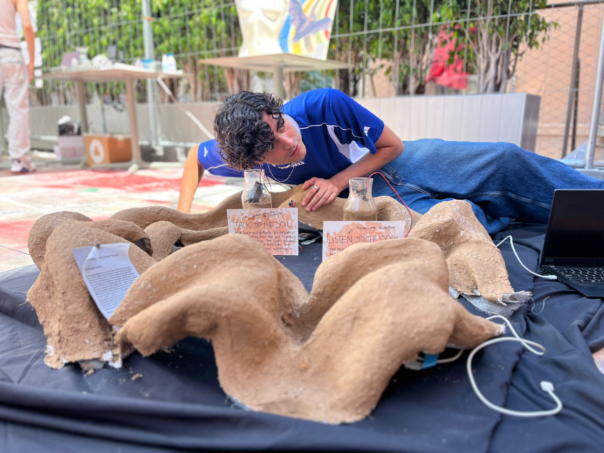

# Fabricating MDEF Fest: Soil Reciprocities {: .master-title}

## Personal Reflection 

My goal with the Soil Reciprocities was to design a reciprocal interspecies communication system to practice mutual healing with different soil communities through an interactive installation. The installation of clay with embedded mycelium acts as an artifact of bioremediation through low-frequency sounds and mycelial activity in the soil, but it is meant to also engage humans as participants of the process. With human touch the sculpture activates and reveals the sounds of bioremediation to human ears. And the installation also invites human participants to leave their voice as a soil offering to further enhance bioremediation (sound can stimulate mycelial growth). In this way, I was clear I didn’t want the sculpture to be only a technical system but a site of ritual of soil care, so the challenge was how to create interaction and human engagement. 

My hypothesis of interaction is that sounds of the soil can teach humans to become more attune to soil worlds, and, in turn, people can feel compelled to broadcast restorative sounds to soil, making them active participants of bioremediation processes. Now I need to test if human participants engage easily in this two-way form of communication with the soil, and what improvements I can make to the interaction based on that.  In my current design I made the installation circular and simulating the wave of sound, so that participants would sit in the middle of the circle in a meditating pose. That is the body position the sculpture invites, but when more than one person is checking the exhibition I found the limits of this design. People ended up siting around the installation. However, the collective touch did change the volume of the music (sonification of soil humidity) so this aspect does work for a collective experience. 
Overall, I now found it interesting to see how the installation could accommodate not only an individual intimate experience, but also a collective experience of people sharing the space, maybe even speaking to the soil simultaneously. This will imply I need to configure the electronic system to accommodate more interactions. I think I went half way though with designing this first prototype based on my own experience and bodily preferences, and now the interaction of people (new users) with the installation can give me more ideas of how to make this temporal architecture into a collective site of rituals for soil care. 
As I continue, I have 4 future branches of action: 

## Multispecies soil communities: 
this work line will focus on situating my experiments in concrete sites of Barcelona. This will imply building relationships with human and more-than-human communities, understanding their relationship with soil and the type of intervention that makes sense for the selected sites. One community where I would like to start is Valldaura Labs in Collserola mountain since I already connected my work to this site, but other sites can include soil vulnerable sites such as polluted land or other communities like urban gardens. 

## Material experimentation: 
This work line will focus on testing the impact of different soil species on soil health, whether that is bioremediation of polluted soil sites or increasing soil biodiversity in communal gardens. The material experimentation will be connected to the sites of future testing. This also includes testing collective practices of building as a form of early engagement with human audiences. 

## Sensor and sonic experimentation:
this line of work will focus on learning more in-depth the techniques of sonification of soil data, from theory of sound to technical skills to translate soil sensor data into melodies. It also encompasses the exploration of how geometry, materialities, scaffolding and human presence in the installation can compose different sonic experiences for humans and more-than-humans, and how they form sonic healing feedback loops. 
## Rituals of soil reciprocity: 
This line of work focuses on exploring different ritualistic practices in western and nonwestern worldviews that engage with soil, for example ancient practices of soil offerings to the Pachamama, but also new ritualistic practices that are emerging in multispecies design and posthuman art. This is key to understanding how to design not only physical systems but holistic experiences that can nurture new cultures of soil care. This entails testing different soil rituals on the selected sites and reflecting on the assemblages created by those rituals. 

