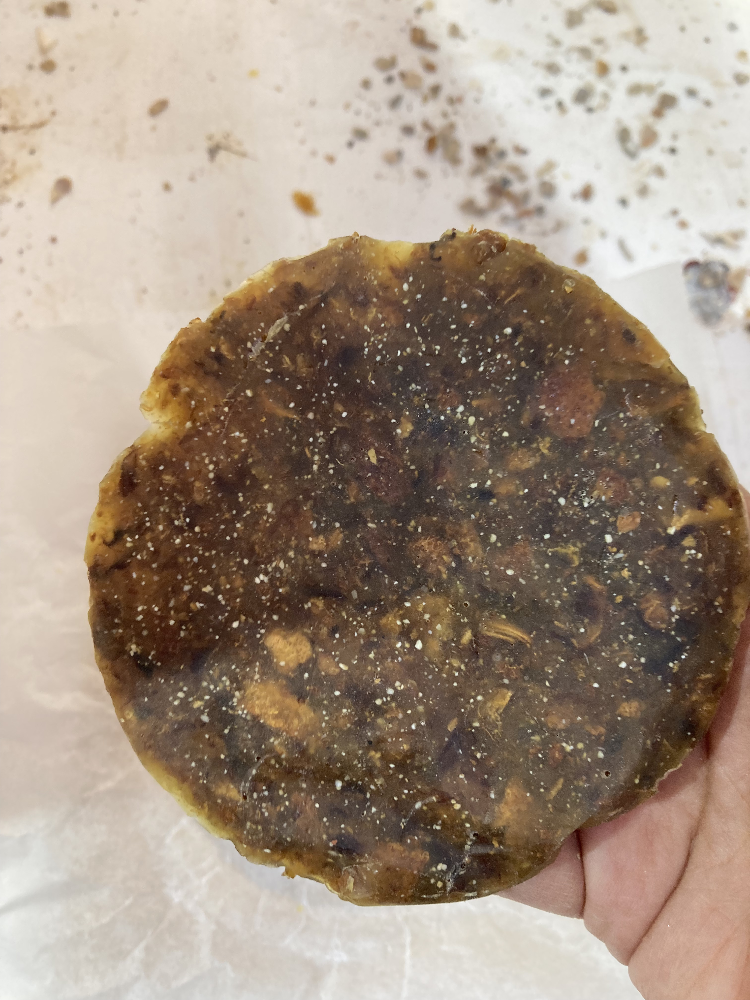

# Fundamentals of Making {: .master-title}

Throughout the overall design process, we took inspiration from organic forms. This approach was reflected in the use of undulating lines and mountain-like morphologies in the mold design. This course helped me explore how natural patterns can inform digital fabrication techniques across multiple processes.

## Laser Cutting

For this exercise, we were given a generic box design with the option to personalize the internal walls. We took inspiration from the natural pattern of tree rings and created a section of this geometry using Adobe Illustrator. The design was then further processed in Rhino, where we prepared the file for laser cutting using Rayjet Manager. This step allowed us to translate organic, natural patterns into precise, machine-readable geometries.

## 3D Printing

In the 3D printing exercise, we took inspiration from the morphology of mountains. But instead of opting for a smooth surface, we chose a layered topology inspired by Andenería Andina, an ancestral Andean agricultural technique that adapts mountainous terrain into terraces to create diverse microclimates. Due to the complexity of this geometry, Rhino alone was insufficient, so we used Grasshopper to generate and control the layered form. The final piece was printed using Bamboo Studio. This was one of my favorite stages of the process, as it aligned with my curiosity about using organic forms for mold-making applications.

## Molding

For the molding exercise, we poured silicone into the box containing the 3D-printed mountain form. Initially, we were concerned that the mold would not capture the finer details of the terrain. However, we learned that silicone is highly effective at reproducing small-scale details. The final mold successfully and accurately reflected the layered mountain geometry from the 3D print.

## CNC Milling

In this exercise, we were asked to create a hollow square as a placeholder for a final object. To maintain conceptual continuity with the previous steps, we integrated the mountain shape into the CNC-milled design. We prepared the toolpaths using RhinoCAM. Among all the fabrication technologies explored, CNC milling was the one I had the least time to fully understand. Nevertheless, I am eager to explore it further, especially because of its potential for creating large-scale molds for biomaterials such as bioplastics or mycelium-based objects.

## Biomaterials

The biomaterials exercise was the most exciting part of the project for me, as I have a strong interest in this field. Ironically, it also proved to be the most challenging. We selected a resin-and-wax-based recipe intended to produce a hard object. 

Although we correctly scaled up the quantities from a small-scale recipe, our first result did not meet expectations: the material remained sticky and lacked structural solidity. Cleaning the mold afterward was particularly difficult.

To address this, we conducted several small-scale tests to better understand the behavior of the material. 

Through experimentation, we learned how to adapt the recipe for larger volumes. The filler (we used shrimp shells) played a crucial role in providing structural integrity, and although most ingredients were scaled proportionally, the alcohol—which dissolves the resin—needed to be increased only slightly, as excessive amounts made the mixture too liquid. Additionally, allowing the mixture to cool slightly before pouring helped the ingredients integrate more effectively. 

Finally, we got the desired outcome: the mountain-object in the texture and color of sand dunes. 

