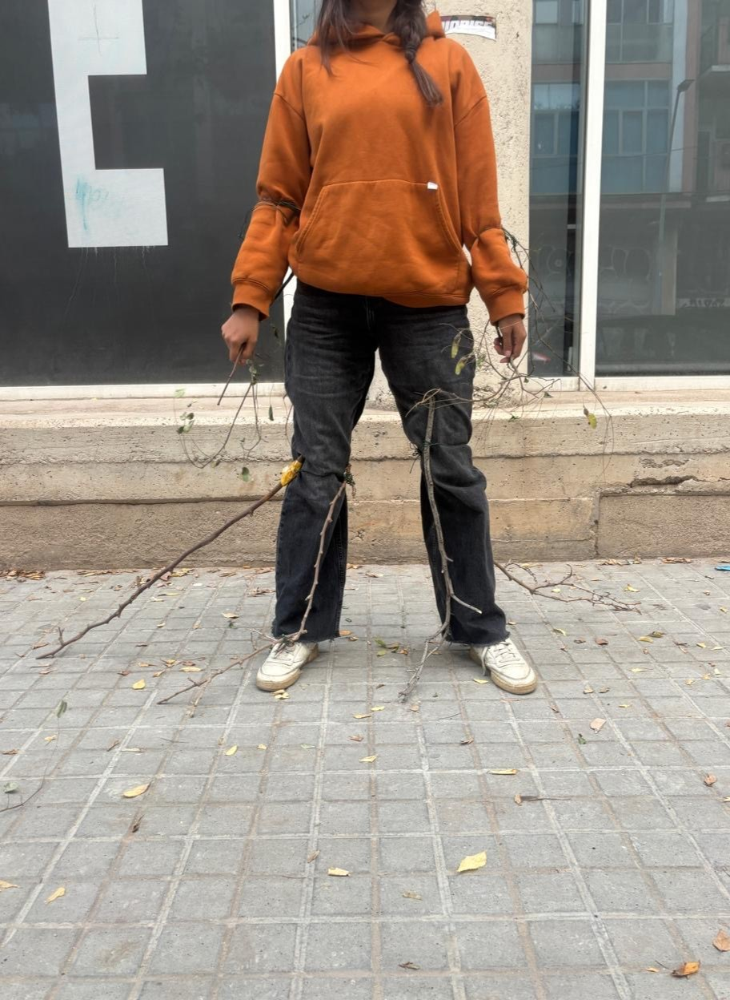

# Prothesis One: Echoing Branches {: .master-title}

 ___“Through the branches of a fallen tree, I expand my hearing. In the echoes of my movement, I hear the mountain”___

Echoing Branch es is a sculptural extension of the body — a structure of tree branches that expands my spatial awareness through sound. Each branch acts as an external sensory limb, equipped with contact microphones at its tips. As I move, the branches brush against the environment, picking up subtle vibrations and surface contacts. These mechanical signals are converted into electrical ones, then sonified and transmitted to my skull via bone-conduction transducers. Through this, I perceive the textures and micro-movements of the surrounding space as sound — experiencing the world’s surfaces and resonances without obstructing my natural hearing.

##Reflection##

For some time now, I have been drawn to a curious endeavor: talking to the mountains. But how does one even begin to listen to a mountain? Sometimes nature speaks to us loudly — birds chirping, frogs croaking, bees humming. But listening to abiotic nature is a challenge. A mountain exists in deep time: static to our perception, immense beyond our grasp. Then it occurred to me — could movement be a language to communicate with the mountain? After all, movement only emerges through my conscious interaction with the mountain’s morphology. It is a dialogue. The mountain affords my movement. Yet my body feels so small compared to its vastness. I felt the urge to expand — even if a bit — the reach of my body.
 
The notion of cyborg offered some inspiration for this experiment. Cyborg art is about creating new senses or expanding the existing ones to better connect to ecologies. My challenge was to develop a sensory prothesis to untap a new channel of communication with the mountain. However, I’ve long felt uneasy about the conventional aesthetics of sensory augmentation that are loaded with electronics, wires, and synthetic materials — a technological skin that, to me, feels at odds with the organic world I seek to attune to. I wanted to expand my sensory system with natural elements. So I set up to collect fallen tree branches in Poblenou. This was the starting point for Echoing Branches.

I attached the branches with a wire so that any person could wear them in the arms, legs (below the knees) and back. I ran some tests in the space of IAAC building (Thanks Ayal for wearing the branches!).

And outside in the streets of Poblenou! I extended the reach of my body with the branches. As I walked, I could feel subtle vibrations through the branches — traces of movement, friction, and contact.

Now I am ready for the mountain. But could I go further? Could this tactile sense also become audible? By attaching contact microphones to the branches’ tips, I could translate those vibrations into sound, amplifying the otherwise inaudible interactions between my movement and the mountain. Walking would be transformed by the act of bringing the sounds of the biotic to the forefront of my acoustic experience. Can the sound of the movement tell me something about the mountain? What conversations will emerge? Through the branches of a fallen tree, I expand my hearing. In the echoes of my movement, I hear the mountain
  

<table border="1">
  <tr>
    <td>
Prothesis brief: Becoming the best version of yourself.  
Inspiration: Becoming a cyborg by Manuel de Aguas, song “Voy Creciendo” by Natalia Doco.  
Materials: fallen tree branches picked up from Poblenou.  
Keywords: Listening to the mountain, movement as language, movement to sound, augmenting human senses.  

</td>
  </tr>
</table>

# Prothesis Two: Mycosensing {: .master-title}

___“When I think with fungi, I feel the urge to decompose”___

Mycosensing is a prosthesis inspired by fungal chemotropism—the ability of hyphae (the growing tips of mycelium) to sense, map, and grow toward their food sources. The device invites us to embody this chemical perception, allowing humans to participate in the fungal act of exploration and decomposition. With Mycosensing, we can help fungi map new landscapes of decomposition within the novel ecologies of cities. The prosthesis detects potential waste materials that could be decomposed by different fungal species and guides the user through vibrational cues that intensify as they approach a suitable substrate. Connected to an online knowledge platform, Mycosensing can also suggest how to prepare the identified waste as a substrate for fungal cultivation and decomposition.

##Reflection##
I worked in sustainability science for years, where everyone spoke about societal transformation—yet the visions of “desirable futures” often felt like a form of escapism. Since I began working with fungi in Berlin, I’ve come to think about transformation differently. Fungi taught me to think about decomposition. Too often, we leap toward utopian futures—blank canvases where the wildest sustainable dreams can be realized—without acknowledging the material consequences of colonialism, industrialism, and capitalism in the biosphere. In the Anthropocene, we live in damaged landscapes, already in decay. As Donna Haraway reminds us, we must stay with the trouble on a planet in ruins. That’s why I see decomposition as a needed metaphor for transformation: it asks us to begin where we are, to give a good death to maladapted systems—from toxic materials to toxic institutions. When I think with fungi, I feel the urge to decompose.

Fungi are nature’s alchemists, masters of transformation. I am constantly amazed at the metabolic power.  They break down dead matter—from fallen trees to animal remains—returning nutrients to the ecosystem. But what is their new ecological role in this damaged planet, filled with trash and toxic materialities? Fungi did not evolve to decompose these novel materials, and yet, remarkably, many can—experiments show them digesting plastic and even oil. This makes me think that fungi have a new role in the novel ecologies of the Anthropocene. Could I collaborate with fungi, helping them to explore new and potential landscapes of decomposition in the streets of Barcelona? If I were a fungus in the city, what would I want to eat and decompose?

But how can I embody the act of decomposing? The first thing that came to my mind was: Well, how does mycelium know where to grow? Fungi don’t have eyes in a traditional sense, but they grow toward their food guided by what they sense chemically. The fungal body, called mycelium, is made up of countless fine threads known as hyphae, which grow outward through soil or organic matter. Each hypha can sense its surroundings using specialized receptors on its cell membrane that detect chemical cues such as sugars, amino acids, and organic acids. When a hypha detects a favorable chemical gradient—like a rising concentration of nutrients—it redirects its growth toward the food source. This reminds me of how plant roots grow toward nutrients. Once it reaches the food, the fungi secrete enzymes into the surrounding material to break down complex substances like cellulose, proteins, or lipids into smaller, absorbable molecules. It’s like an external stomach! Through this combination of chemical sensing, directional growth, and external digestion, mycelium effectively “finds” and digest food. The most alien thing I can possibly imagine. 

This is how Mycosensing emerged as a speculative tool for thinking with fungi. I imagined a device equipped with chemical sensors that could scan waste and suggest which fungal species might decompose it.

 Mycosensing would help me become fungi, or at least act as their representative. After identifying a potential fungal food source, I could take that waste to a biolab and assist the fungi in digesting it, preparing a substrate for mycelium to colonize. So I assembled the prothesis, wore it and tested it. 

After walking through the streets of Poblenou with Mycosensing, another idea emerged: Wouldn’t it be nice that this prothesis is also a sort of spore-releasing device that matches specific types of waste with the spores of fungi capable of decomposing them? It’s a bit like guerrilla seeding. Guerrilla sporing?

<table border="1">
  <tr>
    <td>
Prothesis brief: Becoming something else.  
Inspiration: Becoming a goat by Thomas Thwaites.  
Materials: cables, metal grid, plaster bands for arm.  
Keywords: chemical sensing, decomposing, embodying the fungi. 

</td>
  </tr>
</table>

# Prothesis Three: It's all about perception {: .master-title}

Are we always performing for an eye gaze? Playing a role that fits the audience? I was given the unusual opportunity to stage how I would like to be perceived knowing upfront that I was going to be followed and analyzed by a classmate. The only trick: I didn’t know who. I found myself having almost an opposite reaction to creating a mysterious prototype my classmate would have to decipher. Given the warning that I will be observed, I decided I wanted to just exist and follow what my body wanted at that moment: rest! I had been a intense week. So I climbed up the stairs to IAAC terrace and melted away in a wood bench. The perfect spot for looking at the sky, isolating from the crowd behind my headphones and some relaxing tunes of my Spotify.  I did not want to give my classmate any reason to overthink. I wanted her to just watch me relax and relax too. 

Later, I was on the other side of coin. Following my subject of observation (Maryam) was equally relaxing. I followed her to the terrace to eat lunch, and we even shared some food. This is how I spent most of the time with her. Not as an external observer, but interacting with her, just chilling. She was carrying around a prothesis which was her own glasses with a picture of an eye on each side. 

If she wore it, she couldn’t see anything. We, the audience, could see some fake eyes glued to each lens. Open, never blinking. She didn’t wear these glasses during lunch, because it was impractical. But after lunch she modelled them for some of us (she didn’t know I was following her, I think!). Her real eyes were hidden under the prothesis-glasses but somehow, she acted as if she could see us. She became playful and posed for the cameras. I wondered what changes if can hide our eye gazes, who do we become, do we have more permission to be ourselves, or to become a different version? To hide or to let out parts of us?
