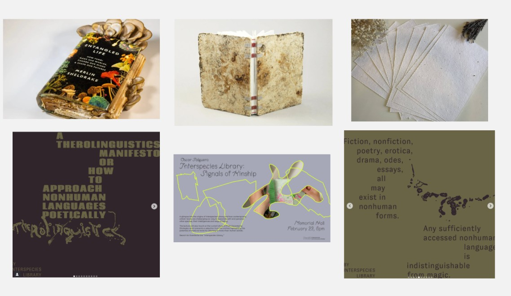

# Narratives I {: .master-title}

## Publication Concept: Soil Reciprocities

### Core Concept
Soil Reciprocities is a publication that explores the dynamic, two-way relationships between humans and the living soil. It frames soil not as a passive resource, but as a collaborative partner—a complex community of organisms with which we can communicate, learn from, and co-create. The project investigates these reciprocal exchanges in 2 chapters: 

### Chapter 1: Listening and Speaking to Soil
This chapter investigates eco-acoustic restoration as interspecies communication. It documents experiments in listening and speaking to soil through vibrations and sound. Graphic Strategy: Visualizations of sound wave data, spectrograms, and frequency graphs rendered as ethereal, organic forms. These will interweave with handwritten field notes and fragments of poems to the soil.

### Chapter 2: Soil architectures
This chapter shifts to material collaboration, exploring how soil organisms like bacteria, mycelium, and root systems can be partners in growing sustainable, earthly structures. Graphic Strategy: Illustrations inspired by bacterial and mycelial growth. These will interweave with fabrication recipes and field notes.

Materiality: It will be printed on plantable seed paper, embedded with plant seeds or mycelium. After reading, the book itself can be planted back into the earth.

